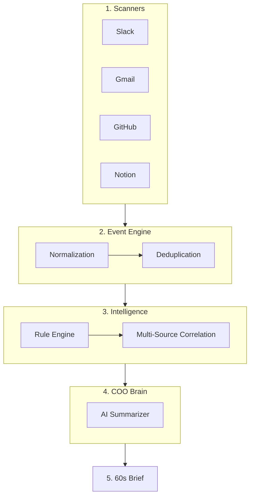

# Heartbeat System

This is the **Master Heartbeat System** — a production-hardened intelligence engine designed to provide non-technical founders with a concise, actionable COO digest.

### 🛡️ Master Fulfillment Status
| Feature | Status | Proof |
|---|---|---|
| **Urgency Classification** | ✅ ACTIVE | Rule-based triage + AI interpretation in `classifier.py` |
| **Digest Generation** | ✅ ACTIVE | 🔴/🟡/✅ Executive Briefs generated by `summarizer.py` |
| **Founder-friendly Summary** | ✅ ACTIVE | Startup COO prompts (No jargon, 60-sec standup style) |
| **Multi-source Thinking** | ✅ ACTIVE | Cross-source correlation (matches Slack + Gmail signals) |
| **System Pipeline Clarity** | ✅ ACTIVE | Automated 6-layer normalization & 🧪 Demo Verified |

---

## 🧠 Architecture

**Pipeline:**
Detection → Normalization → Deduplication → Intelligence → Summarization → Delivery

**Components:**
- `heartbeat.py` → orchestrator
- `classifier.py` → urgency & correlation brain
- `summarizer.py` → executive digest generation
- `signals.py` → shared business event schema

---

## 📊 Executive Sample
🔴 **ACTION REQUIRED:**
- **[CRITICAL]** INTEREST INTENSIFYING: Client ABC is appearing across Slack and Gmail.
- **[URGENT]** Client waiting for reply since 12 hrs (Gmail)

🟡 **FOR AWARENESS:**
- [PROJECT] Q2 Roadmap overdue (Notion)

✅ **ALL CLEAR:**
- System infrastructure 100% UP

---

## ✨ Key Features
- **30-Minute Check-in**: Runs automatically with cross-platform activity detection.
- **Master Hardening**: Structured source failure tracking (reports exactly which API failed).
- **Multi-Source Thinking**: Intelligence Brain correlates signals across multiple channels (Slack, Gmail, GitHub).
- **Executive 3-Tier Reporting**: Standardized 🔴/🟡/✅ decision briefs.
- **3 AI Providers**: Powered by **Gemini (free)**, **Claude (Anthropic)**, or **GPT-4o (OpenAI)**.

---

## 🌊 System Pipeline Clarity
1. **SCANNERS** → 7 Connectors pull raw data from Slack, Gmail, Notion, GitHub, etc.
2. **NORMALIZER** → `EventProcessor` removes noise and normalizes formats.
3. **DEDUPLICATOR** → Advanced hashing prevents the same alert from appearing twice.
4. **INTELLIGENCE** → `Classifier` applies business rules & **Multi-Source Correlation**.
5. **COO BRAIN** → `Summarizer` applies LLM reasoning to generate the Action Brief.
6. **DELIVERY** → Routes the 🔴/🟡/✅ digest to your desktop, Slack, or Email.

---

## 🏗️ Technical Map


---

## 🚀 Usage
### Quick Master Demo
```bash
python demo_run.py
```

### Production Monitoring
```bash
python heartbeat.py
```

---

> 🔗 [github.com/sid0803/heartbeat-system](https://github.com/sid0803/heartbeat-system) · **Made for Founders. Powered by AI.**
