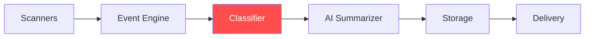
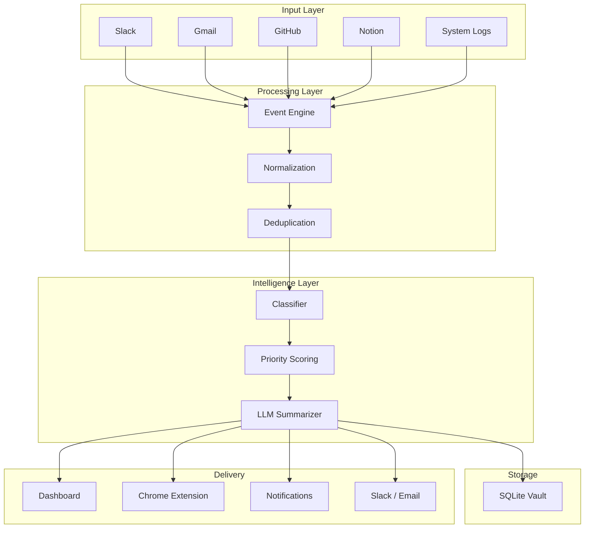
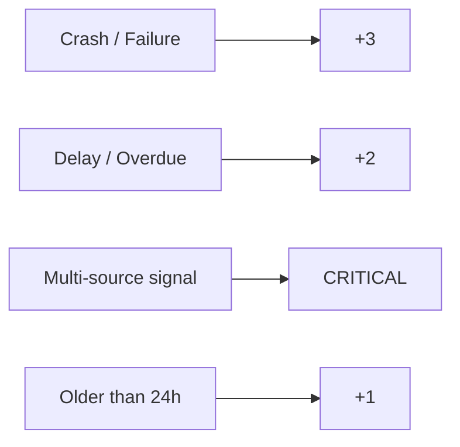

# 💓 Heartbeat : Your Universal Personal Intelligence System

### **From 100 Notifications → 1 Clear Decision**

> Your **Personal AI Chief of Staff** that turns scattered signals (Slack, Gmail, GitHub, Notion) into a single, actionable executive brief.

---

## 🧠 What is Heartbeat?

**Heartbeat** is a **privacy-first, local intelligence system** that continuously scans your digital ecosystem and delivers:

* 🔴 Critical issues (revenue risk, system failure)
* 🟡 Important follow-ups (delays, blockers)
* ✅ Informational updates (low-priority changes)

👉 Every **30 minutes → 1 clear decision**

---

## ⚡ How It Works (10 Sec Overview)



👉 **Signals → Context → Priority → Decision → Delivery**

---

## 🤯 Before vs After

| Without Heartbeat ❌ | With Heartbeat ✅ |
| ------------------- | ---------------- |
| 50+ notifications   | 1 clear brief    |
| Context switching   | Deep focus       |
| Missed priorities   | Ranked actions   |
| Stress              | Control          |

---

## 🏗️ System Architecture



---

## 🧠 Core Intelligence Layers

### 1. 🔍 Scanners (Input Layer)

* Slack → Urgent messages
* Gmail → Revenue-risk emails
* GitHub → PRs, issues
* Notion → Tasks & roadmap
* Logs → System health

---

### 2. 🧹 Event Engine

* Normalizes data into unified format
* Removes duplicates across sources

---

### 3. 🧠 Classifier (The Brain)

* Assigns **Priority Score (0–10)**
* Detects:

  * 🚨 Failures
  * 💰 Revenue risks
  * ⏳ Delays
  * 🔗 Cross-source signals

---

### 4. 📝 AI Summarizer

* Converts raw signals → **human decisions**
* Powered by:

  * Gemini / Claude / GPT / Local LLM

---

### 5. 📂 Persistence Layer

* Local SQLite storage
* Enables:

  * Daily summaries
  * Historical insights

---

### 6. 🔔 Delivery Layer

* Chrome Extension
* Dashboard
* Notifications
* Slack / Email

---

## 🎯 Priority Scoring Logic



### Final Output:

* 🔴 Critical (Act Now)
* 🟡 Warning (Needs Attention)
* ✅ Normal (Informational)

---

## 📝 Example Output (What Users Actually Get)

```txt
🔴 CRITICAL:
- Payment system failure detected (Slack + Gmail)
- Impact: Revenue loss risk

🟡 WARNING:
- GitHub PR #342 inactive for 48 hours

✅ INFO:
- Notion roadmap updated

👉 Recommended Action:
Fix payment system immediately. Follow up with backend team.
```

---

## 💻 Developer View (Pipeline)

```python
def heartbeat_pipeline():
    events = scan_sources()
    normalized = normalize(events)
    scored = classify(normalized)
    summary = generate_summary(scored)
    store(summary)
    deliver(summary)
```

---

## 🗄️ Database Schema (SQLite)

```sql
CREATE TABLE users (
    id INTEGER PRIMARY KEY,
    email TEXT,
    password_hash TEXT
);

CREATE TABLE connector_configs (
    id INTEGER PRIMARY KEY,
    user_id INTEGER,
    connector_type TEXT,
    config_json TEXT
);

CREATE TABLE digests (
    id INTEGER PRIMARY KEY,
    user_id INTEGER,
    content TEXT,
    timestamp DATETIME DEFAULT CURRENT_TIMESTAMP
);
```

---

## 🚀 Quick Start

### 1. Clone Repo

```bash
git clone https://github.com/sid0803/heartbeat-system
cd heartbeat-system
```

### 2. Backend Setup

```bash
pip install -r requirements.txt
python server/main.py
```

### 3. Frontend Setup

```bash
cd dashboard
npm install
npm run build
```

### 4. Load Extension

* Go to `chrome://extensions`
* Enable Developer Mode
* Load `/dashboard/dist`

---

## 🔒 Privacy-First Architecture

* ✅ 100% Local Processing
* ✅ SQLite (no external DB)
* ✅ No raw data leaves device
* ✅ Optional LLM usage

👉 **Your data never becomes someone else's model**

---

## 🧠 Why Heartbeat Wins

| Feature                | Traditional Tools | Heartbeat |
| ---------------------- | ----------------- | --------- |
| Multi-source reasoning | ❌                 | ✅         |
| Local-first AI         | ❌                 | ✅         |
| Executive summaries    | ❌                 | ✅         |
| Noise filtering        | ⚠️                | ✅         |
| Decision engine        | ❌                 | ✅         |

---

## 🧩 Supported Connectors

| Tool   | Purpose                  |
| ------ | ------------------------ |
| Slack  | Team communication       |
| Gmail  | Client & revenue signals |
| GitHub | Dev workflow             |
| Notion | Task tracking            |
| Logs   | System monitoring        |

---

## 🗺️ Roadmap

* [ ] Discord Integration
* [ ] Telegram Alerts
* [ ] Jira / Linear Support
* [ ] Voice Briefing (AI audio)
* [ ] Mobile App

---

## ❓ FAQ

**Q: Why is nothing showing?**
→ Trigger the first scan manually.

**Q: Is it free?**
→ Yes (use Gemini free tier or local LLM).

**Q: Can I build my own connector?**
→ Yes, extend `BaseConnector`.

---

## ⭐ Final Thought

> Most tools give you **more data**
> Heartbeat gives you **clear decisions**

---


