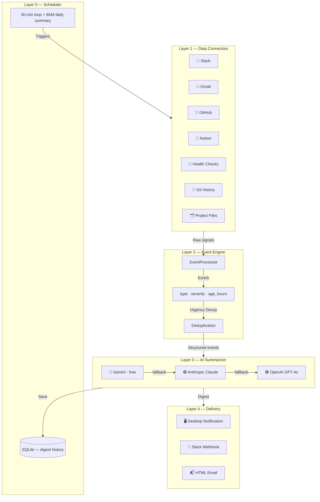

# 💓 User Copilot

An intelligent, multi-layer monitoring and summarization tool designed for **non-technical founders**. Stay informed without reading logs, dashboards, or mountains of Slack messages — get a plain-English digest every 30 minutes.

[](https://www.python.org/)
[](https://opensource.org/licenses/MIT)

---

## 🎯 The Problem

Founders often feel "blind" to their project's technical progress. They either spend hours in technical meetings or lose situational awareness entirely. **User Copilot** fixes this by translating complex technical events — from Slack messages to stale GitHub PRs to overdue Notion tasks — into a 5-bullet-point executive digest, delivered to your desktop, Slack, or email.

---

## ✨ Key Features

- **30-Minute Check-in**: Runs automatically with cross-platform activity detection (Mac, Windows, Linux).
- **3 AI Providers**: Powered by **Gemini (free)**, **Claude (Anthropic)**, or **GPT-4o (OpenAI)** — switch via one config line.
- **7 Data Connectors**: Slack, Gmail, GitHub, Notion, Git history, health endpoints, and project file scan.
- **Smart Triage**: Urgency decay — stale events auto-escalate after 4 hours so nothing falls through the cracks.
- **3 Delivery Channels**: Desktop notification, Slack webhook, or HTML email digest.
- **Daily Executive Summary**: A "Big Picture" report delivered every morning at 8:00 AM.
- **Founder Feedback Loop**: Coach the AI directly via `heartbeat/config/feedback.txt` to adjust its style.
- **Mock Mode**: Works fully without any API keys — great for demos and onboarding.

---

## 🏗️ System Architecture

User Copilot follows a **5-layer architecture** where each layer converts raw signals into cleaner, more actionable output.



---

### Component Overview

1. **Layer 0 — Scheduler**: Activity-aware loop (skips cycles when you're away). Triggers the 8AM daily summary automatically.
2. **Layer 1 — Connectors**: 7 pluggable data sources. Each degrades gracefully to rich mock data when API keys are absent.
3. **Layer 2 — Event Engine**: Normalises raw signals into a structured schema (`type`, `severity`, `client`, `age_hours`, `suggested_action`). Stale items escalate automatically.
4. **Layer 3 — AI Summarizer**: Sends enriched events to your chosen LLM and returns a 5-point founder digest. Auto-selects the best available key.
5. **Layer 4 — Delivery Engine**: Routes the digest to desktop, Slack, email, or all three simultaneously.

---

## 🚀 Getting Started

### Prerequisites

- Python 3.8+
- At least one AI API key *(optional — system works in mock mode without any key)*:
  - **Gemini** (free): [aistudio.google.com](https://aistudio.google.com/) — no credit card needed
  - **Anthropic**: [console.anthropic.com](https://console.anthropic.com/)
  - **OpenAI**: [platform.openai.com](https://platform.openai.com/)

### Installation

```bash
# Clone the repo
git clone https://github.com/sid0803/user-copilot.git
cd user-copilot

# Install dependencies
pip install -r requirements.txt
```

### Configuration

```bash
# Copy the example env file
cp .env.example .env
```

Edit `.env` and add your keys (you only need one):

```env
GEMINI_API_KEY=your-free-gemini-key    # recommended — free tier
ANTHROPIC_API_KEY=sk-ant-...           # optional
OPENAI_API_KEY=sk-...                  # optional
```

Set your preferred AI provider in `heartbeat/config/settings.yaml`:

```yaml
ai:
  provider: "auto"   # auto | gemini | anthropic | openai
  # "auto" tries Gemini first, then Anthropic, then OpenAI
```

Set your project path and any health endpoints to monitor:

```yaml
connectors:
  git:
    repo_path: "."          # path to your project folder
  health:
    endpoints:
      - "https://your-api.com/health"
```

---

## 🛠️ Usage

### Quick Test (no API key needed)

Runs the full system in mock mode — see exactly what a founder receives:

```bash
python demo_run.py
```

### Test Suite

Validates all 7 connectors and the event schema:

```bash
python test_heartbeat.py
```

### Production Run

Starts the background monitoring loop (every 30 minutes + 8AM daily summary):

```bash
python main.py
```

---

## 🔌 Connector Setup

| Connector | Env Var / File | How to get it |
|---|---|---|
| **Slack** | `SLACK_TOKEN` | [api.slack.com/apps](https://api.slack.com/apps) → OAuth & Permissions → `channels:history` scope |
| **Gmail** | `heartbeat/config/gmail_credentials.json` | Google Cloud Console → Gmail API → Download credentials.json |
| **GitHub** | `GITHUB_TOKEN` | Settings → Developer Settings → Personal Access Tokens |
| **Notion** | `NOTION_TOKEN` + `database_id` in settings.yaml | [notion.so/my-integrations](https://www.notion.so/my-integrations) + share DB with integration |
| **Health** | Endpoint URLs in settings.yaml | Add your API/dashboard URLs |
| **Git / Files** | `repo_path` in settings.yaml | Local folder path |

> All connectors fall back to **rich, realistic mock data** when credentials are absent.

---

## 📬 Delivery Modes

Set `delivery.preferred` in `heartbeat/config/settings.yaml`:

| Value | What happens |
|---|---|
| `desktop` | Cross-platform desktop notification (default) |
| `slack` | Sends digest to Slack via incoming webhook |
| `email` | Formatted HTML email via SMTP (works with Gmail App Passwords) |
| `all` | Sends to all three simultaneously |

---

## 🛡️ Reliability & Security

- **Local First**: All scanning runs on your machine. No data leaves without your keys.
- **Activity-Aware**: Skips heartbeat cycles when system is idle for 30+ minutes — saves API costs.
- **Graceful Degradation**: Every layer has a fallback. The system never crashes silently.
- **No Vendor Lock-in**: Switch AI providers in one line of config.

---

## 🗺️ Roadmap

- [x] Cross-platform activity detection (Mac / Windows / Linux)
- [x] Full codebase mapping
- [x] Daily 8AM executive summaries
- [x] Multi-provider AI — Gemini · Claude · GPT-4o
- [x] Gmail, GitHub, Notion connectors
- [x] HTML email delivery
- [x] Semantic event engine (type, age, suggested action)
- [ ] Voice command status queries
- [ ] Weekly "CEO Performance" report
- [ ] Mobile push notification

---

## 📄 License

Distributed under the MIT License. See `LICENSE` for more information.

---

> 🔗 [github.com/sid0803/user-copilot](https://github.com/sid0803/user-copilot) · **Made for Founders. Built by humans. Powered by AI.**
